# Algorithms and state model

This document describes decision logic that affects user-visible results. Thresholds are conservative so automatic work can abstain instead of making a destructive match.

## Episode state machine

The implementation is centralized in `pudge/episode_state.py`; database mutations record accepted transitions in `episode_state_history`.

```mermaid
stateDiagram-v2
    [*] --> local: video scan
    local --> waiting_subtitles: prepare
    waiting_subtitles --> waiting_text_subtitles: bitmap detected
    waiting_subtitles --> ready: text validated
    waiting_text_subtitles --> ready: OCR or text replacement validated
    ready --> watched: playback threshold
    watched --> ready: explicit progress reset
    local --> dropped: drop title
    waiting_subtitles --> dropped: drop title
    waiting_text_subtitles --> dropped: drop title
    ready --> dropped: drop title
    dropped --> local: explicit restore
```

Worker stages such as discovering, extracting, OCR, aligning and validating are job state, not durable media state. Keeping them separate prevents a process crash during OCR from corrupting what the library knows about the video.

`transition_episode_state(current, requested, trigger)` enforces three rules:

1. scans cannot erase terminal/user states (`watched`, `dropped`);
2. scans cannot demote `ready` or the bitmap fallback `waiting_text_subtitles`;
3. only explicit repair triggers may move a valid episode backwards.

When duplicate paths are merged, `stronger_episode_state` chooses the state with the greatest evidence in the order `dropped < local < waiting_subtitles < waiting_text_subtitles < ready < watched`. The special scan rules protect `dropped`, which is user intent rather than preparation strength.

## Subtitle selection

Subtitle preparation is a staged pipeline:

1. discover embedded/external/Jimaku candidates;
2. reject wrong languages and implausible episode identities;
3. normalize text and timing;
4. evaluate deterministic timing hypotheses (embedded reference, constant offset, ALASS, container chapters/transitions, audio activity);
5. use cached tiny Japanese STT only after ordinary methods fail;
6. validate language, coverage, timing and optional semantic evidence;
7. select the best validated candidate and transition to `ready`.

Bitmap subtitles enter OCR only when enabled. They remain evidence for `waiting_text_subtitles` but never masquerade as selectable text. FFT energy/spectral-flux regions gate spoken intervals for audiobook and fallback timing so highlights pause during silence.

### Sparse spoken prologues

Some broadcast Japanese captions contain three to six spoken cues, then music/SFX cues throughout the opening, while the embedded translation is silent until the main dialogue. A broad activity window cannot isolate the prologue and may invent a wrong neighbouring offset.

After ALASS, Pudge can apply a rigid local correction only when all of these checks pass:

1. the spoken prologue starts in the first 45 seconds and is followed by at least 45 seconds without another dialogue cue;
2. its onset-gap fingerprint has one stable match before the embedded track's main dialogue;
3. start/end offsets agree within 0.8 seconds and the corrected onset error is at most 0.65 seconds;
4. the first main-dialogue cue is already aligned within 0.9 seconds;
5. shifting every cue in the pre-main block cannot reorder cues or overlap the main dialogue.

The correction never changes the already-aligned main episode. Diagnostics retain the inferred correction, onset errors, fingerprint error, runner-up margin and post-opening error.

## Nyaa ranking and automatic episode runs

Before network search, Pudge builds local episode evidence from the database and a fresh scan. Automatic Planning runs skip every local episode. Search expands title aliases while retaining the requested episode or batch constraint.

Release score combines title/episode identity, trusted/preferred/blocked group rules, resolution, codec, source, Japanese-audio evidence, size plausibility, seeders and explicit penalties such as upscales. Automatic selection requires the configured minimum score. Release upgrades additionally require `new score - old score >= Minimum release score gain` and obey the configured interval and per-run maximum.

## Inflected-form pitch accent

For surface text `S`, token ruby ranges `(start, end, reading)` replace their exact slices to construct reading `R`. If uncovered kanji remain, Pudge falls back to the parser's token reading. Mora segmentation treats small kana as part of the preceding mora and the long-vowel mark as its own timing unit.

Accent selection is:

1. use token/surface accents when Jiten supplies them;
2. otherwise take the dictionary card downstep;
3. keep heiban `0`, or clamp a positive downstep to `len(morae(R))`;
4. label the result `pitchDerived` when `R` differs from the dictionary reading.

The derived branch is a display fallback, not a claim that every conjugation has an independently verified lexical accent. This distinction is retained in the DOM/CSS and can later be replaced by a morphological accent provider without changing the reader contract.

## LN/audiobook automatic linking

Titles are Unicode NFKC-normalized, HTML-decoded, case-folded and stripped of file extensions, media words, punctuation and volume markers. Volume is extracted from `vol`, `volume`, `v`, `第N巻` or `N巻`.

For each unlinked audiobook and LN:

- conflicting explicit volumes reject the candidate;
- normalized title similarity uses RapidFuzz ratio;
- equal explicit volumes add 8 points;
- an equal AniList ID raises the score to at least 120;
- the best candidate must score at least 90;
- it must beat the runner-up by at least 8 points, including when several local volumes share one series-level AniList ID.

An existing link is never overwritten. Identity propagation fills only a missing identity. These constraints make automatic linking useful for clean filenames while leaving genuinely ambiguous libraries for manual selection.

## Job Center persistence

Every operation writes an `app_jobs` row with immutable ID, kind, retry payload, attempt parent, timestamps and mutable state/progress. Valid states are `queued`, `running`, `cancel_requested`, `succeeded`, `failed`, `cancelled`.

Cancellation is cooperative at safe boundaries; subprocess-backed STT/OCR also receives termination. Retry creates a new attempt instead of erasing history. On startup, jobs left active are marked failed as interrupted. JSON payloads contain paths and local IDs needed for retry but no integration credentials.

## Jimaku bundled trial

The release workflow writes `PUDGE_TRIAL_JIMAKU_API_KEY` to a temporary package asset while building the archive and removes the source asset on exit. Runtime uses the bundled key for 48 hours after first use unless a personal key is configured. The bundled key is never persisted to the user's config.
